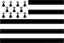

# Anaouder - Istitlañ

 [E brezhoneg](README.md) | 🇫🇷 [Lire en français](README-fr.md) | 🇬🇧 Read in English

**Subtitling and transcription software for the Breton language.**

## Description

**Anaouder** is free and open-source software designed to facilitate the creation of subtitles in Breton.

Developed in collaboration with **Dizale** and funded by the **Région Bretagne**, this software relies on a speech recognition model specifically trained for Breton that runs locally on your computer.

The tool also integrates Breton spell checking thanks to the [hunspell-br](https://github.com/Drouizig/hunspell-br) dictionary from **An Drouizig**.

## Main Features

- [x] Audio-to-text transcription (Specialized Breton Vosk model).
- [x] Integrated subtitle editor.
- [x] Spell checking (Hunspell).
- [x] Export to standard formats (`.srt`, `.eaf`, `.txt`).

## Download and Installation

The application is available for Windows, Linux, and macOS (Apple Silicon or Intel).

*   Download the latest stable version [here](https://github.com/gweltou/anaouder-gui/releases) or on [Dizale.bzh](https://www.dizale.bzh/anaouder.html).

## Partners

This project is the result of a collaboration between developers and Breton cultural actors.

  
  &nbsp;&nbsp;&nbsp;&nbsp;&nbsp;&nbsp;&nbsp;&nbsp;&nbsp;&nbsp;&nbsp;&nbsp;&nbsp;&nbsp;
  
  &nbsp;&nbsp;&nbsp;&nbsp;&nbsp;&nbsp;&nbsp;&nbsp;&nbsp;&nbsp;&nbsp;&nbsp;&nbsp;&nbsp;
  

---
*License: GPLv3*