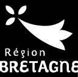

# Anaouder

**Logiciel d'aide au sous-titrage et à la transcription pour la langue bretonne.**

 <!-- Décommentez et ajustez si vous avez un logo principal pour l'app -->

## Description

**Anaouder** est un logiciel libre et open-source conçu pour faciliter la création automatique de sous-titres en langue bretonne.

Développé en collaboration avec **Dizale** et financé par la **Région Bretagne**, ce logiciel s’appuie sur un modèle de reconnaissance vocale spécifiquement entraîné pour le breton et fonctionnant localement, sur votre ordinateur.

L’outil intègre également une correction orthographique adaptée grâce au dictionnaire **hunspell-br** de l'association **An Drouizig**.

## Fonctionnalités principales

- [x] Transcription audio vers texte (modèle Vosk spécialisé breton).
- [x] Éditeur de sous-titres intégré.
- [x] Correction orthographique (Hunspell).
- [x] Export vers les formats standards (`.srt`, `.eaf`, `.txt`).

## Téléchargement et Installation

L'application est disponible pour Windows et Linux et macOs (Apple Silicon ou Intel).

*   Téléchargez la dernière version stable [ici](https://github.com/gweltou/anaouder-gui/releases) ou sur sur [Dizale.bzh](https://www.dizale.bzh/anaouder.html).

## Partenaires

Ce projet est le fruit d'une collaboration entre développeurs et acteurs culturels bretons.

  <!-- Ajustez les noms des fichiers ci-dessous selon le contenu exact de votre dossier 'res' -->
  
  
  <!-- Ajoutez An Drouizig si vous avez le logo -->
  <!--  -->

---
*Licence : GPLv3*