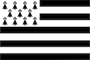
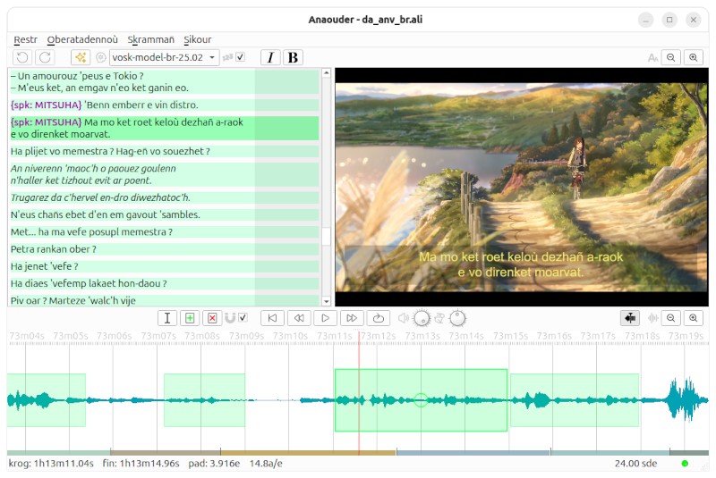
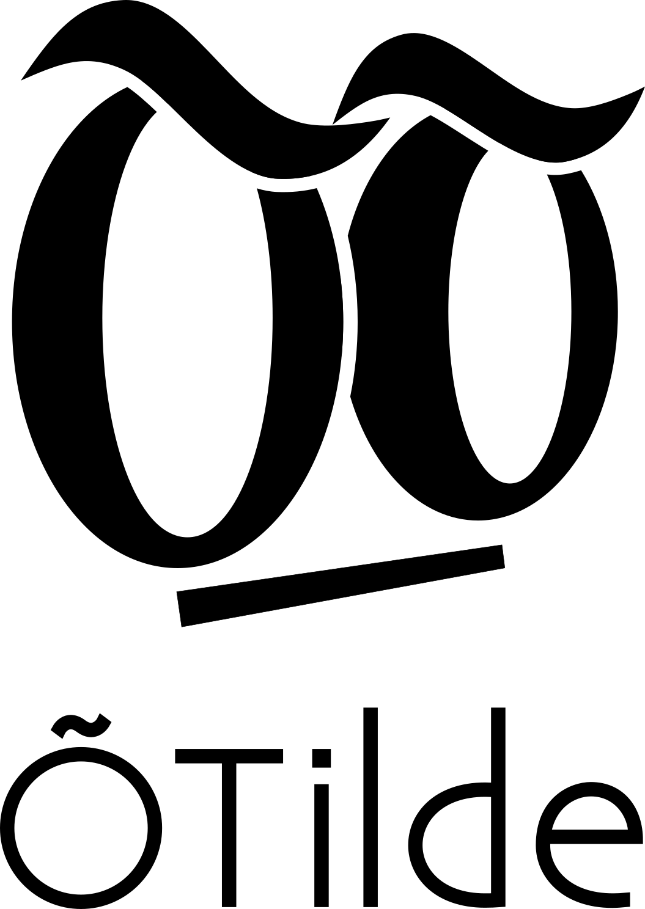
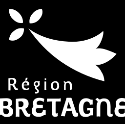

# Anaouder - Istitlañ

 E brezhoneg | 🇫🇷 [Lire en français](README-fr.md) | 🇬🇧 [Read in English](./README-en.md)

**Meziant skoazell d'an istitlañ ha d'an treuskrivañ e brezhoneg.**

## Petra eo ?

Ur meziant frank hag a darzh digor (open-source) eo **Anaouder**, savet evit sikour d'ober istitloù e brezhoneg.

Diazezet eo ar meziant war ur patrom digejañ ar vouezh skañv (doare Vosk), a ya en-dro ez-lec'hel war hoc'h urzhiataer.

Enframmañ a ra difazier reizhskrivadur [hunspell-br](https://github.com/Drouizig/hunspell-br) ar gevredigezh **An Drouizig**.

## Arc'hwelioù pennañ

- [x] Treuskrivañ emgefreek diwar un teuliad son e brezhoneg.
- [x] Aes da gemm ha da reizhañ an istitloù.
- [x] Sikour gant ar reizhskrivañ (hunspell-br).
- [x] Ezporzhiañ war-zu stummoù boutin (`.srt`, `.eaf`, `.txt`).

## Pellgargañ ha Staliañ

A-zere eo ar meziant gant Windows, Linux ha macOS (Apple Silicon pe Intel).

* Posupl eo pellgargañ ar stumm diwezhañ [amañ](https://github.com/gweltou/anaouder-gui/releases) pe war lec'hiennn [Dizale](https://www.dizale.bzh/anaouder.html).

## Kevelerien

Frouezh ur c'henlabour etre ar **Rannvro Breizh**, ar gevredigezh **Dizale** hag an embregerezh **OTilde** eo ar meziant-se.

  
  &nbsp;&nbsp;&nbsp;&nbsp;&nbsp;&nbsp;&nbsp;&nbsp;&nbsp;&nbsp;&nbsp;&nbsp;&nbsp;&nbsp;
  
  &nbsp;&nbsp;&nbsp;&nbsp;&nbsp;&nbsp;&nbsp;&nbsp;&nbsp;&nbsp;&nbsp;&nbsp;&nbsp;&nbsp;
  
  &nbsp;&nbsp;&nbsp;&nbsp;&nbsp;&nbsp;&nbsp;&nbsp;&nbsp;&nbsp;&nbsp;&nbsp;&nbsp;&nbsp;
  

---
*Lañvaz : GPLv3*
